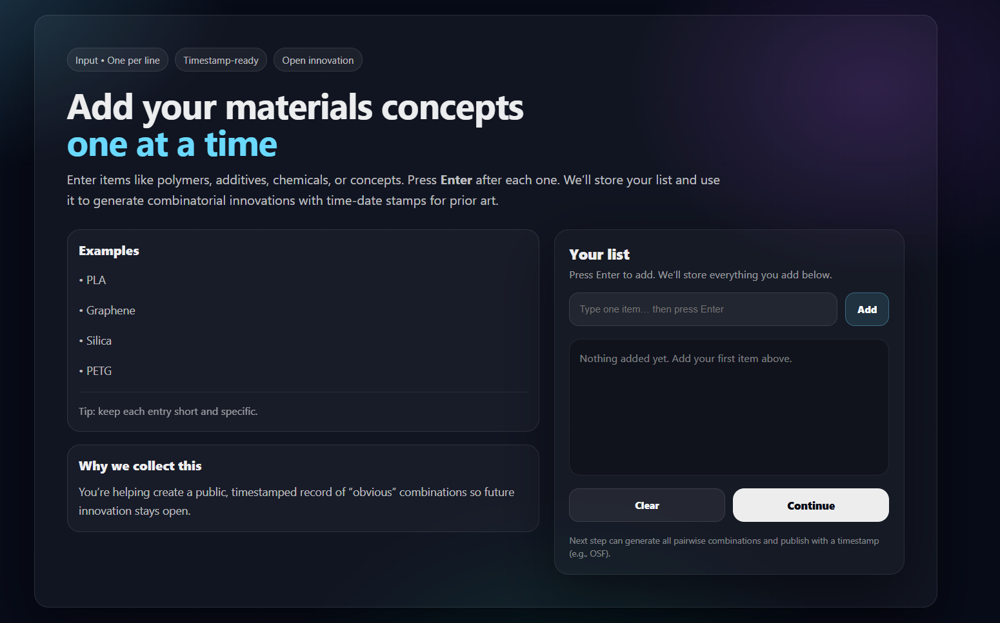

# 🔬 Open-Source Innovator

A full-stack web platform that generates **combinatorial innovations** from user-defined lists of materials or concepts — automatically publishing timestamped records to the web as **open-source prior art**.

Built as part of a research collaboration with **Dr. Joshua Pearce** at the [Open Sustainability Technology Lab](https://www.appropedia.org/Open-source_3-D_printing_materials_database_generator), Western University.

---

## 🚀 What It Does

Users input custom lists of materials, chemicals, or concepts. The platform computes **every possible combination** of those inputs and publishes the results with timestamps to [OSF.io](https://osf.io), creating verifiable open-source prior art that prevents future patents on those combinations.

**Example:** Input 5 materials → generates 10⁵+ unique combinatorial innovations, all timestamped and publicly accessible.

---

## ✨ Features

- **Custom Input Lists** — users define their own materials or concepts (e.g. synthetic chemicals, 3D printing materials, design concepts)
- **Combinatorial Engine** — generates all k-material combinations from user-supplied datasets
- **Automated Publishing** — pushes thousands of timestamped records per run to OSF.io
- **Open-Source Prior Art** — every generated combination is publicly accessible and verifiable
- **Modular Pipeline** — refactored from legacy research code to support arbitrary user-defined datasets
- **Zero Cloud Cost** — deployed on university-hosted infrastructure

---

## 🛠 Tech Stack

| Layer | Technology |
|-------|-----------|
| Frontend | React |
| Backend | Python, FastAPI |
| Data Publishing | OSF.io API |
| Legacy Research Code | Jupyter Notebook |
| Hosting | University-hosted servers (UWO) |

---

## 📁 Project Structure

```
innovation_website/
├── frontend/          # React web interface
├── backend/           # FastAPI backend + combinatorial engine
├── 3-D-Printing-Materials-Generator-main/  # Original research code (refactored)
└── .gitignore
```

---

## ⚙️ Getting Started

### Prerequisites
- Python 3.9+
- Node.js 16+
- OSF.io account (for publishing)

### Backend Setup
```bash
cd backend
pip install -r requirements.txt
cp .env.example .env   # Add your OSF.io API token
uvicorn main:app --reload
```

### Frontend Setup
```bash
cd frontend
npm install
npm start
```

### Environment Variables
Create a `.env` file in `/backend`:
```
OSF_API_TOKEN=your_osf_token_here
```

---

## 📖 Research Background

This project is based on the open-source materials database research by Dr. Joshua Pearce. The original paper and code can be found here:

> [Open-source 3-D Printing Materials Database Generator](https://www.appropedia.org/Open-source_3-D_printing_materials_database_generator)

This platform generalizes that research — moving beyond 3D printing materials to support **any user-defined dataset**, enabling researchers and innovators across all fields to protect their ideas as open-source prior art.

---

## 🤝 Contributing

This is an open-source research project. Contributions, issues, and feature requests are welcome.

---

## 📄 License

All generated combinations are published under open-source licenses to ensure public accessibility and prior-art protection.

---

## 👨‍💻 Developer

**Aman Sharma** — CS Student @ Western University  
[LinkedIn](https://www.linkedin.com/in/aman-sharma-086310271/) · [Portfolio](https://aman-portfolio-three-xi.vercel.app/) · [GitHub](https://github.com/venom11-coder)

*Built under research supervision of Dr. Joshua Pearce, Open Sustainability Technology Lab, Western University.*


